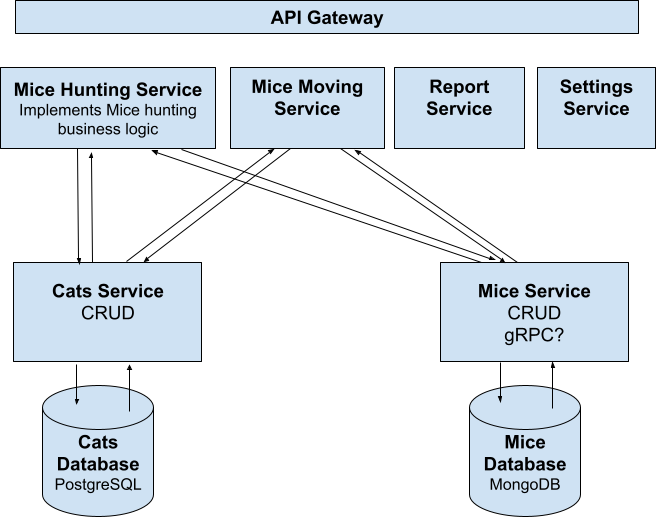

# Mice vs Cats project
### **Catch Me If You Can**
### The project goal:
Key project goal is a technical demo for a microservices approach.
As well we want to research some regularity in Mice & Cats relations.
### Main heroes
Cats - everyone knows about them.
Mice - little animals with long tails
### Key actors responsibility
Cats want to catch mice.
Mice try avoid Cats
### Key actors properties
### Cats props
- Name
- Age
- Color
- Normal Speed
- Jump Speed
- Agility
- Eyesight
  ### Mice props
- ID
- Age
- Color
- Normal Speed
- Top Speed
- Reproductive Rate
- is dead
### Key business rules
The room is a rectangle with width and length.
In the room are a few Cats and a number of Mice.
Cats and Mice are walking inside the room and can’t leave.
When a cat sees a mouse, it tries to catch it, and the mouse tries to avoid it.
If the cat wins, the mouse dies.
We persist info of mice catched by cats and event time.
### Key Reports
We want to know how cats' properties correlate with their personal achievements. The personal
achievement is measured in mpt units (mice catched per time unit).
Maybe we want to have a BI system in the future
### Project architecture

